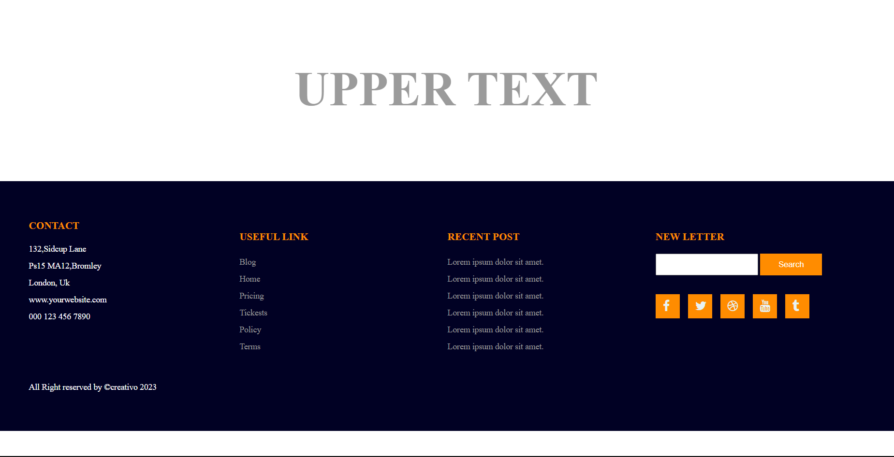

# Responsive Footer Design using HTML and CSS Flexbox

This repository contains an example of a responsive footer design using HTML and CSS with Flexbox. The footer is designed to adjust its layout for different screen sizes and devices.

## Preview

## Features

- Responsive layout using Flexbox.
- Footer adapts to different screen sizes.
- Clean and simple design.
